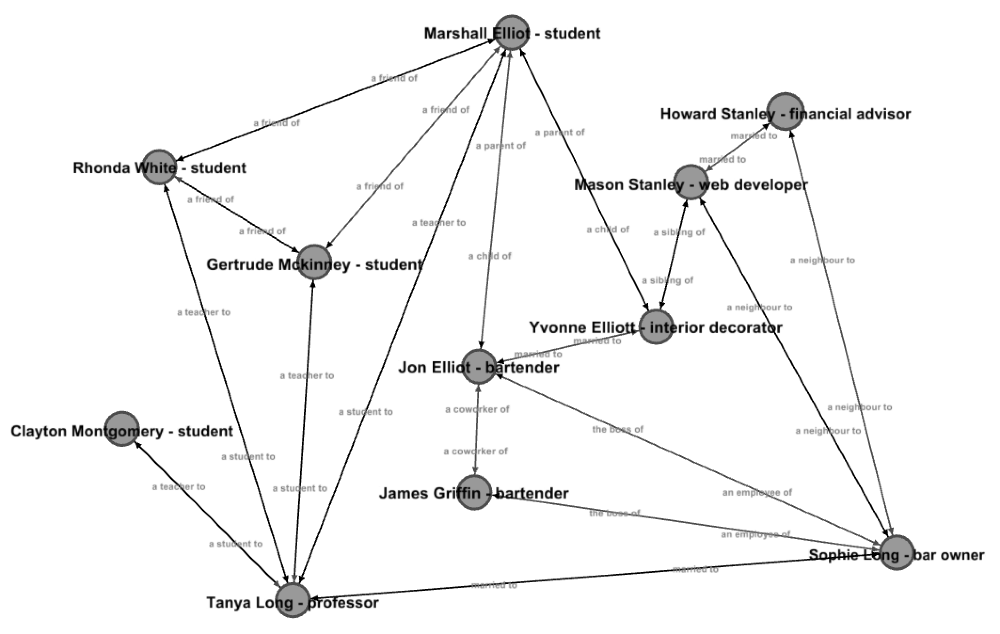

# CSCI 2270 Final Project

**Brandon Eric Phillips**

##  SocSim

...simulates the spread of different kinds of information through a defined community. Using a graph to represent the
community, nodes within the graph represent people and edges within the graph are directed and represent the
relationships between these people. Each relationship has a type and each type of relationship has defined weights that
represent the probability that a specific type of message will be shared or transferred between the two people
that the relationship specifically connects. Each type of message has a default probability of transfer and an optional
maximum number of times the message can be shared (in order to simulate the decay of information value in a simple way).

SocSim generates the community graph from static JSON resources files that define the possible message types, all
possible relationship types, all people, and all of the relationships between people. The user can then input a message
and some important meta data regarding the message and send it through the graph. Stateful information for individual
messages such as who has heard the message, from whom the message came, etc. is stored in a hash table alongside the
message (in what shall be called a parcel), whose data will be formatted and outputted once the message has made its
go-around.

SocSim also provides some analytical data, insight, and predictions about how a message will traverse the community,
such as the most likely path between two people a type of message will take.

### Dependencies

 * [rapidjson](https://github.com/miloyip/rapidjson/)
    * MIT License
    * Header-only library
    * Bundled with SocSim in [./include/rapidjson](include/rapidjson) per the permission and instruction of the project
      itself

### System Requirements

 * Linux (probably)
 * cmake (3.1+)
 * python (for the [Data Generator](#data-generator); see below)

### Building

Either of the following methods will generate the application as a binary `./bin/socsim`.

#### The easy way:

    $ ./scripts/build.sh
    
This build script cleans up `./build`, runs cmake and make, and copies the executable to `./bin`. Ensure you have
cmake 3.1+ already installed or this script will fail. If you get a permission error, ensure the file has executable
permission:

    $ chmod +x ./scripts/*.sh
    
You  may need to use `sudo` with the above `chmod` command on some distros.

**Hint:** there is also a `./scripts/clean.sh` files that cleans up after `./scripts/build.sh`. `./scripts/build.sh`
executes `./scripts/clean.sh` initially before compilation

**Note:** Both scripts assume CWD is the project root directory (*NOT* `./scripts`)

#### The hard way:

    $ rm -rf build bin
    $ mkdir build bin
    $ cd build
    $ cmake ../
    $ make
    $ cp socsim ../bin/
    
This is essentially what the automated build script(s) do(es).

### Graph Data

Data is stored in `./res/` in multiple JSON files. This is the data loaded into the graph initially. SocSim includes
a small graph of example data.

This representation of the graph has been exported into various formats that can be imported into many different
graph visualization tools/apps. They can be found in [`./res/exported`](res/exported).

The probabilities associated with the various relationship types is not stored in any of the exported representations.
To view this information, use the [Data Generator](#data-generator)

### Data Generator

The default data can be edited manually or generated using a simple HTML/CSS/JavaScript tool included with SocSim.
It relies on AJAX and so must be run in a web server. If you have python installed, you can use the included script
to fire up python's built in HTTP server in the res directory:

    $ ./scripts/datagen.sh
    
Otherwise, as long as `./res/` is reachable by a web server, it should still work.

**Note:** There seems to be a bug in the above script so that the python server doesn't shut down when the script is
killed so you may need to you `ps -A` to find it and `kill [PID]` or `killall [process name]` to kill it.

### Group Members

 * @bericp1 (Brandon Phillips)

### Contributors

### TODO

 * Make up data (JSON res files)
 * ~~Select a JSON lib~~
 * Classes
    * **Community**: graph;
    * **Person**: node; a person with a name and occupation
        * name; string
        * occupation; string
    * **Relationship**: edge;
        * type; string (an existing `RelationshipType` label)
        * from; string (name of `Person`)
        * to; string (name of `Person`)
    * **RelationshipType**: qualifies and quantifies a type of relationship
        * label; string (describes type of relationship; e.g. "married to" or "teaches" or "is a friend of")
        * prob; map/hashtable<string,float> (holds probabilities for the transfer of different message types)
    * **MessageType**: quantifies a type of message
        * label; string (describes the type of message; e.g. "rumor" or "news")
        * prob; float (the default probability for transfer for messages of this type)
    * **Message**
    * **Parcel**: holds a `Message` and a hashtable of data about who has heard the message
 * Construct graph from imported data
 * I/O controller
 * Build hashtable on Message object to store traversal data (seperate tracker class? e.g. "Parcel")